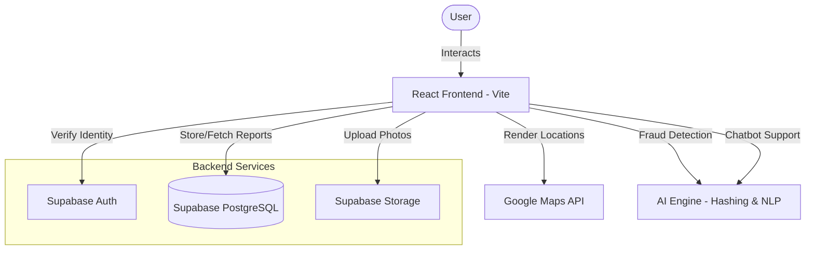

# 🌍 Nagrik Samadhan 🇮🇳
> **Empowering Citizens. Enabling Transparent Governance.**


---

## 🚩 Problem Statement

Traditional civic issue reporting in India faces several critical challenges:
- **Fragmented Reporting**: Lack of a centralized, easy-to-use platform for common issues like potholes, garbage, or streetlights.
- **Lack of Transparency**: Citizens often report issues into a "black box" with no feedback on progress or resolution.
- **No Incentives**: Civic engagement is seen as a chore, leading to low participation from youth and technology-savvy citizens.
- **Verification Issues**: Difficulty for authorities to verify the authenticity and precise location of reported problems.

**Nagrik Samadhan** solves this by providing a location-first, transparent, and gamified platform that bridges the gap between citizens and local governance.

---

## 📐 Simple Architecture Diagram

We use a modern, serverless architecture to ensure high availability, scalability, and performance.



---

## 🛠️ Tech Stack

### Frontend
- **React 18**: Modern UI library for component-based architecture.
- **TypeScript**: Ensuring type safety and robust code.
- **Vite**: Ultra-fast build tool and development server.
- **Tailwind CSS**: Utility-first CSS for premium, responsive styling.
- **Lucide React**: Beautiful, consistent iconography.

### Backend & Infrastructure
- **Supabase**: PostgreSQL database, Authentication, and File Storage.
- **Google Maps Platform**: Geolocation and interactive map rendering.
- **Vercel**: High-performance deployment and hosting.

### AI & Specialized Tools
- **Perceptual Hashing (pHash)**: For AI fraud detection of duplicate images.
- **Verhoeff Algorithm**: For secure Aadhaar number validation.
- **Recharts**: For complex, responsive analytics visualizations.

---

## 🤖 AI Tools Used

| Tool | Purpose |
| :--- | :--- |
| **Antigravity** | Primary agentic AI for complex multi-file coding and refactoring. |
| **Gemini 2.0 Flash** | Core logic generation, debugging, and documentation drafting. |
| **Perceptual Hash AI** | Algorithmic implementation for real-time fraud detection. |
| **GitHub Copilot / ChatGPT** | Assistant tools for boilerplate and quick code snippets. |
| **V0 / Recharts** | Assisted in designing premium, responsive analytics components. |

---

## 📝 Prompt Strategy Summary

Our development followed a **"Module-First" prompt strategy**:

1.  **Inception Prompts**: Defined clear boundaries for state management and API integration.
2.  **Component-Driven Iteration**: Used specific prompts to build reusable UI atoms before assembling pages.
3.  **Refinement Loops**: Iteratively prompted for performance tuning and accessibility improvements.
4.  **Context-Aware Translation**: Managed bilingual support via a centralized locale dictionary generated through targeted prompts.

---

## 📄 Project Documentation Links

- [**Prompt Documentation**](./PROMPT_DOCUMENTATION.md) - Detailed list of prompts used during development.
- [**AI Features Guide**](./AI_FEATURES.md) - Deep dive into implemented AI functionality.
- [**Project Report**](./PROJECT_REPORT.md) - Comprehensive implementation details and impact summary.
- [**AI Disclosure**](./AI.md) - Transparency report on AI usage.

---


## 💻 Source Code Structure

The project follows a clean, modular directory structure for ease of navigation and maintenance:
- `src/components/`: Reusable UI elements and layout components.
- `src/contexts/`: Global state management for languages and authentication.
- `src/pages/`: Main application views (Home, Report, Analytics, etc.).
- `src/lib/`: Custom utilities and AI logic (Hashing, Supabase clients).
- `public/`: Static assets and icons.

---

## ⚡ Setup Instructions

### Prerequisites
-   **Node.js** (v18 or higher)
-   **npm** or **bun**
-   A **Supabase** project (free tier works)
-   A **Google Maps API Key**

### Steps

1.  **Clone the Project**
    ```bash
    git clone https://github.com/saswatdutta1310/Nagrik_Samadhan-_Final.git
    cd Nagrik_Samadhan-
    ```

2.  **Install Dependencies**
    ```bash
    npm install
    ```

3.  **Configure Environment**
    Create a `.env` file in the root and add your details:
    ```env
    VITE_SUPABASE_URL=your_supabase_url
    VITE_SUPABASE_ANON_KEY=your_supabase_anon_key
    VITE_GOOGLE_MAPS_API_KEY=your_google_maps_key
    ```

---

## 📦 Build Reproducibility Instructions (Mandatory)

To ensure judges can successfully run and build the project exactly as intended, follow these steps:

1.  **Clean Install**: Always use `npm install` to ensure the `package-lock.json` is respected.
2.  **Build for Production**:
    ```bash
    npm run build
    ```
    *This will generate a `dist/` folder containing the optimized assets.*
3.  **Local Preview**:
    ```bash
    npm run preview
    ```
    *This runs the production build locally to verify all assets and routes work as expected.*
4.  **Verification**: Navigate to `http://localhost:4173/` (default Vite preview port) to interact with the verified production build.

---

## 🎬 Final Output

### 🌐 Live Demo
[View Live Project on Vercel](https://nagrik-samadhan-final.vercel.app/) *(Placeholder Link - Update with your actual URL)*

### 📸 Project Snapshots
- **Home Dashboard**: Modern, clean interface with quick actions.
- **AI Analytics**: Comprehensive insights into civic issues.
- **Multilingual Support**: Fully functional Hindi and English modes.
- **Fraud Detection**: Real-time alerts for duplicate report attempts.

---

## 🤝 Team BYTE BUSTERS
- **Saswat Dutta** - Full Stack Developer
- **Prabhakar Shukla** - Database Engineer
- **Aditya Kumar** - Frontend Developer
- **Dharitri Padhi** - Idea Innovator
- **B Adarsh Subudhi** - Pitching & Documentation

---

## 📄 License
This project is open-source and available under the [MIT License](LICENSE).

 
