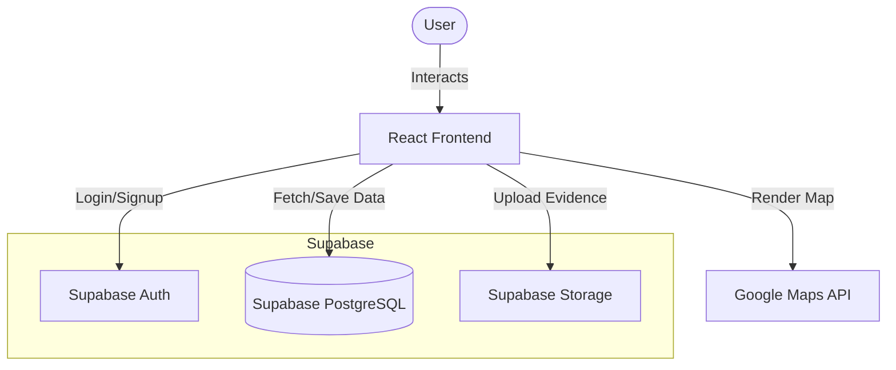
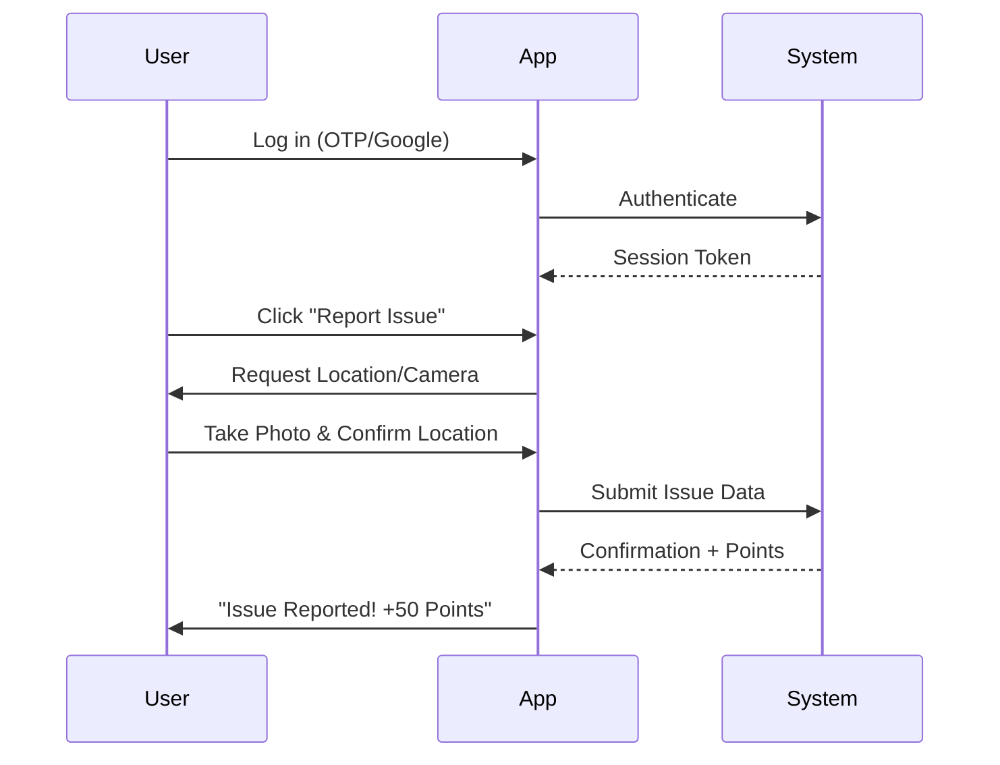

# 🌍 Nagrik Samadhan 🇮🇳
> **Empowering Citizens. Enabling Transparent Governance.**


---

## 🚀 Overview

**Nagrik Samadhan** is a transparent, location-first civic engagement platform designed to bridge the gap between citizens and local authorities. By leveraging real-time geolocation and gamification, we turn civic reporting into an engaging, accountable process.

**Built by Team BYTE BUSTERS.**

---

## 🚩 The Problem
- **Fragmented Reporting**: No central easy-to-use platform for potholes, garbage, or streetlights.
- **Lack of Transparency**: Citizens report issues into a "black box" with no feedback.
- **No Incentives**: Civic engagement feels like a chore with no reward.

## 💡 Our Solution
1.  **Point & Shoot Reporting**: Use Google Maps to pin precise locations.
2.  **Real-time Tracking**: See the status of your issue change from "Reported" to "In Progress" to "Resolved".
3.  **Gamification**: Earn "Karma Points" for every verified report and climb the Leaderboard.
4.  **Community Driven**: See issues reported by others in your neighborhood.

---

## ✨ Key Features

| Feature | Description |
| :--- | :--- |
| **📍 Geotagged Reporting** | Precise location pinning using Google Maps API ensures authorities know exactly where to go. |
| **🏆 Live Leaderboard** | Top civic champions are recognized, fostering healthy competition. |
| **💰 Citizen Wallet** | Earn points that can be redeemed for rewards (concept). |
| **🔐 Secure Auth** | Phone (OTP) (Coming Soon) and Google Login powered by Supabase for seamless access. |
| **🔔 Instant Notifications** | Get updates when your issue status changes. |

---

## 🛠️ Tech Stack

-   **Frontend**: React.js (Vite), TypeScript
-   **Styling**: Tailwind CSS, Shadcn UI
-   **Backend**: Supabase (PostgreSQL, Auth, Edge Functions)
-   **Maps**: Google Maps JavaScript API
-   **Deployment**: Vercel

---

## 📐 Systems Architecture

We use a serverless architecture to ensure scalability and speed.



## 🔄 User Journey



---

## ⚡ Getting Started

### Prerequisites
-   Node.js (v18+)
-   Supabase Account
-   Google Cloud Console Account (for Maps API)

### Installation

1.  **Clone the repository**
    ```bash
    git clone https://github.com/saswatdutta1310/Nagrik_Samadhan-_Final.git
    cd Nagrik_Samadhan-
    ```

2.  **Install dependencies**
    ```bash
    npm install
    ```

3.  **Environment Setup**
    Create a `.env` file in the root directory:
    ```env
    VITE_SUPABASE_URL=your_supabase_url
    VITE_SUPABASE_ANON_KEY=your_supabase_anon_key
    VITE_GOOGLE_MAPS_API_KEY=your_google_maps_key
    ```

4.  **Run Locally**
    ```bash
    npm run dev
    ```

---

## 🤖 AI Usage Disclosure

We are committed to transparency and responsible innovation.
-   **AI as an Assistant, Not a Creator**: AI tools were used for documentation, boilerplate code, and learning.
-   **Full Team Ownership**: Every line of code has been reviewed, understood, and validated by our team.
-   **Detailed Report**: See our full disclosure in [AI.md](AI.md).

---

## 🗺️ Roadmap

- [x] **Phase 1**: Core Reporting & Geolocation (MVP)
- [ ] **Phase 2**: Authority Dashboard & Ticket Resolution
- [ ] **Phase 3**: AI-based Severity Analysis (Computer Vision)
- [ ] **Phase 4**: Public API for Open Data initiatives

---

## 🤝 Team BYTE BUSTERS

-   **Saswat Dutta** - Full Stack Developer
-   **Prabhakar Shukla** - Database Engineer
-   **Aditya Kumar** - Frontend Developer
-   **Dharitri Padhi** - Idea Innovator

---

## 📄 License
This project is open-source and available under the [MIT License](LICENSE).

---

> *Built with ❤️ for a better tomorrow.*
